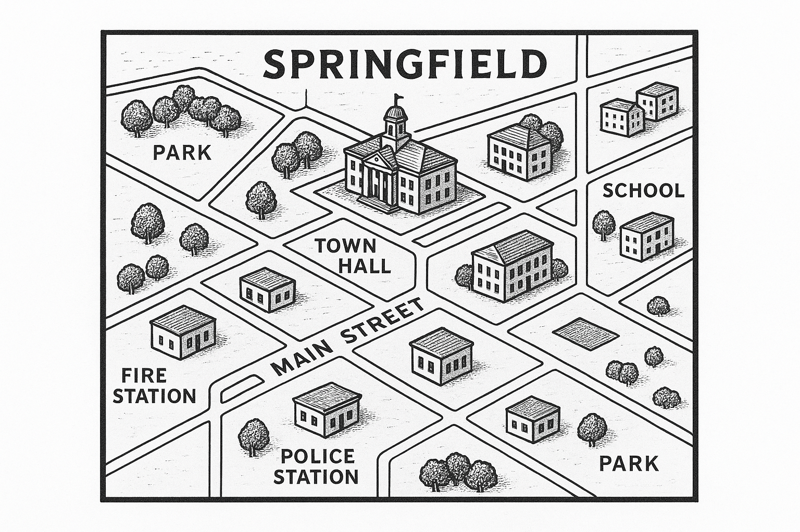

<p align="center">
  
</p>

## 1. Geographic Location

**Location:** Springfield, Cascade County, Montana
**Coordinates:** 47.5083° N, 111.2831° W
**Elevation:** 3,670 feet (1,119 meters)
**Area:** 18.7 square miles (48.4 km²)
**County Seat:** Great Falls (22 miles northeast)

### Geographic Context

Springfield is located in north-central Montana, nestled in the foothills where the Rocky Mountain Front meets the Great Plains. The municipality sits along the Sun River, approximately 22 miles southwest of Great Falls, the state's third-largest city.

```
┌─────────────────────────────────────────────┐
│                 MONTANA                      │
│                                              │
│    Glacier NP                                │
│        ▲                                     │
│        │  Shelby                             │
│        │    ●                                │
│   Rocky│                                     │
│   Mtns │         Great Falls                │
│    ▲▲▲▲│            ●────┐                  │
│    ▲▲▲▲│                 │ 22 mi            │
│    ▲▲▲▲│         SPRINGFIELD               │
│    ▲▲▲▲│            ★                       │
│    ▲▲▲▲└─Sun River──┘                       │
│        │                                     │
│        │  Helena (91 mi S)                  │
│        │    ●                                │
│                                              │
│              Great Plains ───────────→       │
└─────────────────────────────────────────────┘
```

### Terrain and Climate

Springfield's geography is characterized by rolling hills transitioning to mountainous terrain to the west. The Sun River provides a natural water source and created the fertile valley where the city developed. The landscape features a mix of prairie grasslands, cottonwood groves along the river, and pine forests on higher elevations.

**Climate:**
- Semi-arid continental climate (Köppen: BSk)
- Average high temperature: 59°F (15°C)
- Average low temperature: 35°F (2°C)
- Annual precipitation: 14.2 inches
- Average snowfall: 52 inches
- Growing season: 115 days (mid-May to early September)
- Chinook winds provide periodic winter warming

### Nearby Landmarks

- **Sun River Canyon** (12 miles west): Popular recreation area
- **Gibson Dam** (28 miles west): Historic dam on Sun River
- **Rocky Mountain Front** (15 miles west): Dramatic geological feature
- **Great Falls** (22 miles northeast): Regional commercial hub
- **Lewis and Clark National Forest** (18 miles west): Federal wilderness
- **Malstrom Air Force Base** (29 miles northeast): Major employer for region

---

## 2. Demographics

### Population Statistics

| Year | Population | Change | Notes |
|------|-----------|--------|-------|
| 1890 | 487 | - | First census after incorporation |
| 1900 | 1,243 | +155% | Railroad arrival boom |
| 1920 | 3,891 | +213% | Homestead Act migration |
| 1940 | 8,654 | +122% | Depression-era agricultural consolidation |
| 1960 | 15,234 | +76% | Post-war suburban expansion |
| 1980 | 24,789 | +63% | Manufacturing growth |
| 2000 | 31,456 | +27% | Technology sector emergence |
| 2020 | 34,892 | +11% | Steady growth |
| 2024 | 35,743 | +2.4% | Current estimate |

### Current Demographics (2024)

**Age Distribution:**
- Under 18: 22.3%
- 18-34: 24.1%
- 35-54: 26.8%
- 55-64: 13.2%
- 65+: 13.6%

**Median Age:** 38.7 years

**Racial/Ethnic Composition:**
- White: 82.4%
- Native American: 6.8%
- Hispanic/Latino: 4.9%
- Asian: 2.1%
- Black/African American: 1.8%
- Two or more races: 1.7%
- Other: 0.3%

**Educational Attainment (25+ years):**
- High school graduate or higher: 91.3%
- Bachelor's degree or higher: 32.8%
- Graduate/professional degree: 11.4%

### Economic Indicators

**Median Household Income:** $62,450
**Per Capita Income:** $34,890
**Poverty Rate:** 9.7%
**Unemployment Rate:** 3.8% (as of Q3 2024)

**Employment by Sector:**
- Manufacturing: 18.2%
- Healthcare/Social Services: 16.8%
- Retail Trade: 13.4%
- Education: 11.9%
- Professional/Technical Services: 9.7%
- Agriculture/Natural Resources: 8.3%
- Construction: 6.2%
- Hospitality/Food Services: 5.8%
- Government: 5.1%
- Other: 4.6%

**Major Employers:** Springfield Regional Medical Center (1,247 employees), Cascade Precision Manufacturing (892 employees), Springfield Public Schools (734 employees), Mountain Valley Foods (628 employees), and the municipality itself (487 employees).

---

## 3. History Timeline

### Founding Era (1860-1899)

**1862:** First documented settlement by fur trappers establishing a trading post at the confluence of two creeks near the Sun River. The location became known as "Spring Field" due to numerous natural springs that kept the meadows green year-round.

**1867:** William Thaddeus Cartwright established the first permanent homestead and built a water-powered sawmill. The settlement grew to include 23 residents.

**1874:** Discovery of gold in nearby streams led to a brief mining rush. While deposits proved modest, the influx of prospectors established Springfield as a supply hub.

**1877:** The Springfield Ferry Company, founded by Marcus Hollenbeck, began operations across the Sun River, charging 25 cents per wagon.

**1881:** Springfield officially platted as a town. Population reaches 187. First school established in a one-room cabin.

**1883:** Great Northern Railway surveyed route through Springfield, guaranteeing future growth. Local residents donated 40 acres for rail yards.

**1886:** Town incorporates as the Village of Springfield with Cartwright elected as first mayor. First newspaper, *The Springfield Herald*, begins publication.

**1889:** Montana achieves statehood. Springfield celebrates with three days of festivities, including horse races and a community dance.

**1892:** Catastrophic fire destroys 14 buildings in the commercial district. Community rallies to rebuild with brick and stone construction, establishing architectural character that persists today.

**1897:** Springfield Agricultural College founded by Presbyterian missionaries. Institution would later become Springfield Community College.

**1899:** Population reaches 1,156. Town boasts three hotels, two banks, fourteen saloons, a opera house, and fifty-seven commercial establishments.

### Growth Period (1900-1949)

**1902:** City upgraded from village to municipal status. Council-manager government form adopted.

**1907:** The Sun River Electric Company brings electrical service to Springfield. City hall wired as first public building.

**1911:** Carnegie Library opens on Elm Street, donated by industrialist Andrew Carnegie. Building cost $12,500.

**1915:** Severe flooding of Sun River causes $340,000 in damages. Led to construction of levee system.

**1917-1918:** World War I sees 287 Springfield men serve. Twenty-three killed in action. War memorial erected in Central Square in 1921.

**1924:** Completion of the Springfield Dam on Willow Creek creates Lake Springfield, providing municipal water supply and recreation area.

**1927:** Springfield Municipal Airport established on 240 acres east of town. Initially grass landing strip.

**1929:** Stock market crash impacts Springfield agriculture and banking. Springfield National Bank survives but Springfield Savings & Loan fails, wiping out savings of 347 families.

**1933:** Civilian Conservation Corps (CCC) establishes Camp Springfield. Over three years, 600 young men build trails, plant trees, and construct picnic facilities in city parks.

**1935:** Springfield celebrates golden jubilee of incorporation with week-long celebration. Time capsule buried in front of city hall (to be opened in 2035).

**1938:** Founding of Cascade Manufacturing Company produces agricultural implements. Becomes major employer.

**1941-1945:** World War II transforms Springfield. 512 residents serve in armed forces. Home front supports war production, with Cascade Manufacturing converting to military equipment. Forty-seven Springfield residents killed in action. Memorial field dedicated in their honor in 1947.

**1946:** Post-war housing shortage leads to construction of Victory Heights neighborhood for returning veterans.

**1948:** Springfield Regional Hospital opens, replacing old Mercy Hospital facility. Sixty-bed modern facility serves regional population.

### Modern Development (1950-1999)

**1951:** Completion of U.S. Highway 287 bypass brings increased commerce. Several motor courts and restaurants established.

**1956:** Springfield celebrates centennial with elaborate festivities. President Eisenhower sends congratulatory telegram.

**1959:** Construction begins on Springfield High School campus. Modern facility opens in 1961 with capacity for 1,200 students.

**1964:** Downtown urban renewal project removes several historic but deteriorating buildings. Met with mixed reactions from preservationists.

**1967:** Springfield annexed surrounding areas, doubling geographic size. Population reaches 18,450.

**1972:** Devastating tornado touches down west of Springfield, destroying twelve homes and damaging 127 structures. Two fatalities. Community response praised by national media.

**1974:** Opening of Westfield Mall shifts retail activity from downtown. Begins decades-long discussion about downtown revitalization.

**1978:** Springfield designated as a Montana Main Street Community, spurring downtown preservation efforts.

**1982:** Recession closes Cascade Manufacturing temporarily, laying off 340 workers. Plant reopens in 1984 under new ownership as Cascade Precision Manufacturing.

**1986:** Springfield celebrates centennial of incorporation. Time capsule from 1935 mistakenly opened early during celebration planning (correct capsule remains sealed).

**1991:** Springfield Community Technology Park established on 150 acres, attracting several tech firms.

**1995:** Completion of Springfield Cultural Center, combining library, museum, and performing arts venue. Built with combination of public bonds and private donations totaling $8.4 million.

**1997:** Springfield named an "All-America City" finalist by National Civic League for innovative youth programs.

**1999:** Y2K preparations become major civic effort. Municipal systems updated successfully with no failures reported.

### Contemporary Era (2000-Present)

**2001:** September 11 attacks deeply affect community. Local Air National Guard unit deployed. Vigils and support efforts unite community.

**2003:** Opening of Sun River Business Park brings additional commercial and light industrial development.

**2006:** Springfield wins Montana's "Best Small City" award from *Montana Living* magazine for quality of life, education, and economic opportunity.

**2008:** Global recession impacts Springfield. Unemployment rises to 8.3%. Several businesses close, but community-supported initiatives help small businesses survive.

**2011:** Springfield celebrates 125th anniversary of incorporation with year-long sesquicentennial celebration.

**2014:** Completion of $12.3 million wastewater treatment plant upgrade ensures environmental compliance and supports future growth.

**2016:** Opening of Springfield Innovation Hub, a business incubator and co-working space, attracts entrepreneurs and remote workers.

**2018:** Historic downtown district placed on National Register of Historic Places, recognizing 43 contributing buildings.

**2020:** COVID-19 pandemic hits Springfield. Local government and businesses adapt with support programs. Springfield Regional Medical Center becomes regional treatment center.

**2021:** Springfield Public Library wins National Medal for Museum and Library Service, one of ten institutions nationally recognized.

**2022:** Completion of Rails to Trails conversion creates 8.5-mile multi-use path connecting downtown to Lake Springfield.

**2023:** Springfield wins Governor's Award for Downtown Excellence for revitalization efforts that brought 17 new businesses to historic core.

**2024:** Springfield embarks on comprehensive plan update, engaging citizens in visioning process for next 20 years of development. Current focus on sustainable growth, housing affordability, and infrastructure modernization.

---

## 4. Notable People

### Founders and Pioneers

**William Thaddeus Cartwright (1834-1912)**
First permanent settler and Springfield's founding father. Born in Ohio, Cartwright traveled west seeking opportunity. Established sawmill in 1867 that provided lumber for early construction. Served as first mayor (1886-1890, 1894-1896). Donated land for first school and church. Cartwright Elementary School named in his honor.

**Marcus Hollenbeck (1841-1903)**
Transportation pioneer who established ferry service across Sun River in 1877. Later founded Springfield Freight and Transport Company. Served on city council 1889-1899. His mansion on River Street is now Springfield Historical Society museum.

**Sarah Elizabeth Brennan (1858-1941)**
Teacher, suffragist, and civic leader. Arrived in Springfield in 1882 to teach at one-room schoolhouse. Founded Springfield Women's Club in 1893, advocating for library, parks, and women's voting rights. Organized relief efforts during 1915 flood. First woman elected to Springfield City Council in 1918.

### Business and Industry Leaders

**Jacob "J.P." Petersen (1889-1967)**
Immigrant entrepreneur from Denmark who founded Mountain Valley Creamery in 1919. Built business from single dairy operation to regional food processing company. Philanthropist who funded construction of Petersen Community Pool and contributed to hospital expansions. Employed innovative profit-sharing program for workers.

**Margaret Chen Wang (1923-2008)**
First Asian-American business owner in Springfield. Arrived in 1947 and opened Wang's Grocery, serving community for 48 years. Active in interfaith dialogue and cultural education. Received Springfield Citizen of the Year award in 1985. Her children and grandchildren continue business traditions in Springfield.

**Robert "Big Bob" Mackenzie (1932-2019)**
Founded Mackenzie Construction in 1959 with single truck and wheelbarrow. Built company into major regional contractor responsible for many Springfield landmarks including Cultural Center, high school additions, and hospital expansions. Known for giving chances to young workers and supporting local sports teams.

### Politicians and Civic Leaders

**Senator Thomas Harlan Mitchell (1901-1984)**
Springfield's most prominent political figure. Served as mayor (1935-1943), state representative (1945-1951), and state senator (1952-1972). Instrumental in securing state and federal funding for infrastructure projects. Co-author of Montana Clean Water Act. Mitchell Municipal Building named in his honor.

**Reverend James Whitfield (1928-2011)**
Pastor of First Baptist Church (1959-1998) and civil rights advocate. Led efforts to integrate city facilities and promote racial justice. Founded Springfield Interfaith Council. Mediated labor disputes at local factories. Presidential Citizen Medal recipient in 1999.

**Judge Patricia Yellowtail Runs Above (1956-present)**
First Native American judge in Cascade County. Born on Blackfeet Reservation, graduated Springfield High School in 1974. Returned to practice law in Springfield in 1985. Appointed district judge in 2003. Advocates for tribal-municipal cooperation and restorative justice programs. Still serving.

### Cultural and Scientific Figures

**Edward "Eddie" Callahan (1945-2003)**
Acclaimed Western artist whose paintings of Montana landscapes and cowboy life achieved national recognition. Grew up on ranch outside Springfield. Maintained studio on Main Street from 1972 until death. Works displayed in Smithsonian American Art Museum. Annual Callahan Art Festival celebrates his legacy.

**Dr. Linda Sorenson (1951-present)**
Environmental scientist and author. Springfield native who earned Ph.D. from Stanford. Returned to teach at Springfield Community College. Published definitive study on Rocky Mountain Front ecosystems. Instrumental in protecting Sun River watershed. Continues research and advocacy work.

**Coach Raymond "Ray" Johnson (1958-present)**
Legendary Springfield High School football coach (1986-2023). Led Eagles to six state championships. More importantly, mentored thousands of young people, with 98% of his players graduating high school. Inducted into Montana Coaches Hall of Fame. Retired in 2023 but remains active in community.

### Modern Community Leaders

**Maria Elena Gutierrez (1972-present)**
Executive Director of Springfield Community Action Network since 2005. Transformed small charity into comprehensive social services organization serving 3,000+ families annually. Spearheaded affordable housing initiatives and food security programs. Named Montanan of the Year by *Montana Magazine* in 2019.

**Dr. Samuel Park (1968-present)**
CEO of Springfield Regional Medical Center since 2012. Led hospital expansion and modernization. Recruited specialists to rural community. Pioneered telemedicine programs connecting Springfield to major medical centers. Successfully navigated hospital through COVID-19 pandemic while maintaining financial stability.

**Jennifer "Jen" Blackwell (1985-present)**
Tech entrepreneur who founded DataStream Solutions in Springfield Innovation Hub in 2015. Company grew to 47 employees providing software solutions to municipalities nationwide. Featured in *Forbes* "30 Under 30" list in 2016. Active mentor to aspiring entrepreneurs. Serves on Chamber of Commerce board.

---

## 5. Glorious Moments

### 1. Railroad Arrival Celebration (1885)
When Great Northern Railway announced Springfield as a stop on the transcontinental line, citizens celebrated for three days. The first train arrival on October 12, 1885, drew over 2,000 people from surrounding areas. Golden spike ceremony attended by railway officials. Marked transformation from frontier settlement to commercial hub.

### 2. Survival of the Great Depression (1929-1939)
While many rural communities collapsed during the Depression, Springfield persevered through cooperative efforts. Community-organized barter system, shared harvesting equipment, and municipal work programs kept residents employed. Only one bank failed (compared to regional average of 43%). Local newspaper wrote, "Springfield stands strong when others crumble."

### 3. World War II War Production Achievement (1942-1945)
Cascade Manufacturing converted 100% to military production, producing artillery components and field equipment. Plant workers, including many women in non-traditional roles, exceeded production quotas by average of 23%. Received Army-Navy "E" Award for excellence in war production in 1943, only Montana manufacturer so honored.

### 4. Hospital Construction Campaign (1945-1947)
Community raised $185,000 in 1946 to build Springfield Regional Hospital, exceeding goal by $42,000. Donors ranged from children contributing pennies to major gifts from businesses. Construction completed in eighteen months using local contractors and materials where possible. Dedication ceremony attended by 4,500 people.

### 5. Tornado Recovery (1972)
After devastating tornado on July 14, 1972, Springfield demonstrated resilience. Within hours, neighboring communities sent aid. Within days, volunteers cleared debris. Within three months, all affected homes were repaired or rebuilt. No families permanently displaced. Governor praised Springfield as "model of community strength." Story featured in *Reader's Digest*.

### 6. High School State Championship Three-Peat (1988-1990)
Springfield Eagles football team achieved unprecedented three consecutive Montana Class AA state championships. Teams went combined 38-2 over three seasons. More remarkable was academic achievement: 92% of team members earned college scholarships. Community rallied behind team, filling 6,000-seat stadium for every home game.

### 7. All-America City Finalist (1997)
Springfield named one of ten finalists for All-America City Award by National Civic League. Recognition came for innovative youth development programs addressing rural teen challenges. Springfield Youth Alliance program paired teens with adult mentors, offered job training, and created leadership opportunities. Model program replicated in seventeen other Montana communities.

### 8. Cultural Center Opening (1995)
Grand opening of Springfield Cultural Center marked culmination of fifteen-year community vision. Facility combined library, museum, and 450-seat performing arts theater. Funding came from creative mix: municipal bonds, private donations, corporate sponsorships, and volunteer labor. Opening week featured performances, exhibitions, and dedication by Governor. Building described as "transformative" for community cultural life.

### 9. National Medal for Library Service (2021)
Springfield Public Library selected for National Medal for Museum and Library Service, highest honor for libraries. Recognition came for innovative programs: mobile library serving rural areas, technology training for seniors, seed library for gardeners, and literacy programs. Only Montana institution honored that year. Ceremony attended by First Lady at White House.

### 10. Historic District National Register Designation (2018)
Downtown Springfield historic district placed on National Register of Historic Places after decade-long documentation effort. Recognition of 43 contributing buildings spanning 1886-1949 validated preservation efforts. Designation enabled tax credits spurring additional restoration. Local historian noted: "This recognizes what our ancestors built and obligates us to preserve it."

### 11. Perfect Parade Weather Record (2011)
Springfield's 125th anniversary parade on July 16, 2011, continued community's legendary streak: sixty-three consecutive years of parade-day sunshine. Meteorological records confirm not a single July parade cancelled or significantly disrupted by weather since 1948. Local joke: "Springfield has two guaranteed things: taxes and parade sunshine."

### 12. Regional Spelling Bee Dominance (2003-2010)
Springfield students won regional spelling bee eight consecutive years, advancing to national competition six times. Two students finished in top ten nationally. Success attributed to innovative school program and volunteer coaches. Achievement particularly remarkable given Springfield's small size compared to urban competitors.

### 13. Economic Development Award (2023)
Springfield received Governor's Award for Downtown Excellence, recognizing comprehensive revitalization bringing seventeen new businesses, creating 142 jobs, and attracting $4.3 million private investment to historic core. Efforts included facade improvements, streetscape enhancements, events programming, and business recruitment. National Main Street Center cited Springfield as "rural revitalization model."

### 14. Zero-Fatality Traffic Year (2016)
For the first time in recorded history, Springfield experienced calendar year with zero traffic fatalities. Achievement attributed to intersection improvements, enhanced enforcement, public awareness campaigns, and community commitment to safe driving. Governor presented Community Safety Award. Success continued: only two fatalities in following five years.

### 15. Perfect Municipal Bond Rating (2019)
Moody's upgraded Springfield's municipal bond rating to Aa2, highest in city history. Rating reflected strong financial management, diversified economy, low debt, and consistent tax collection. Upgrade saved taxpayers estimated $280,000 over life of subsequent infrastructure bonds. City manager noted: "This reflects decades of prudent fiscal stewardship."

---

## 6. City Map

<p align="center">
  
</p>

## 6. Major Local Businesses

### Manufacturing and Industry

#### Cascade Precision Manufacturing
**Industry:** Metal fabrication and machining
**Founded:** 1938 (as Cascade Manufacturing Company)
**Employees:** 892
**Location:** 1847 Industrial Parkway

Originally founded as agricultural implement manufacturer during Depression era, company pivoted to military production during WWII. Converted to peacetime production in 1946, nearly closed during 1982 recession, but reopened in 1984 under new ownership with focus on precision manufacturing. Today produces components for aerospace, medical devices, and oil/gas equipment. Customers include Boeing, Lockheed Martin, and Medtronic. Invested $15 million in CNC machining equipment (2019-2023). Strong apprenticeship program partners with community college. Family-owned since 1984 buyout. Largest private employer in Springfield.

**Notable Facts:** Holds seventeen patents for manufacturing processes. Maintains ISO 9001 and AS9100 certifications. Zero lost-time accidents for 1,247 days (as of Q4 2024).

#### Mountain Valley Foods, Inc.
**Industry:** Food processing and distribution
**Founded:** 1919 (as Mountain Valley Creamery)
**Employees:** 628
**Location:** 3401 Sun River Road

Started as small dairy cooperative, expanded through acquisitions and product diversification. Today processes dairy products, processes and packages meats, and distributes throughout Montana and neighboring states. Brands include Mountain Valley Butter, Prairie Fresh beef products, and Cowboy Creek jerky. Operates three facilities in Springfield totaling 240,000 square feet. Milk sourced from forty-seven local dairy farms within 75-mile radius. Recent expansion into organic and specialty products. Third-generation family ownership (Petersen family descendants).

**Notable Facts:** Produces 18 million pounds of butter annually. Pioneered profit-sharing program in 1952, still operational. Springfield's oldest continuously operating business under same family ownership.

#### HighLine Electrical Systems
**Industry:** Electrical equipment manufacturing
**Founded:** 1987
**Employees:** 243
**Location:** 892 Technology Drive

Manufactures electrical switchgear, control panels, and custom electrical enclosures. Serves utility companies, industrial facilities, and commercial construction projects. Specializes in harsh-environment applications suitable for Montana conditions. Engineering-focused company with 38 employees holding engineering degrees. Modern 85,000 square foot facility built in 2008. Won Montana Manufacturer of the Year award in 2015.

**Notable Facts:** Exports products to Canadian provinces and internationally. Maintains UL-certified testing laboratory on-site. Employee retention rate exceeds 94%.

#### Western Aggregate Company
**Industry:** Mining and construction materials
**Founded:** 1956
**Employees:** 187
**Location:** 12 miles west of Springfield (administrative office at 445 Main Street)

Operates gravel pit and quarry producing crushed stone, sand, and aggregate for construction. Primary supplier for road construction, concrete production, and landscaping materials in region. Reserves estimated at 40+ years current production levels. Modern processing equipment installed 2017. Employs seasonal workforce expanding to 240+ during construction season (May-October). Careful environmental management practices earned Montana Reclamation Award in 2020.

**Notable Facts:** Provided all aggregate for Springfield dam project (1924). Supplies material radius of 150 miles. Rehabilitated extraction sites converted to wildlife habitat.

### Healthcare

#### Springfield Regional Medical Center
**Type:** Non-profit hospital and healthcare system
**Founded:** 1947 (current facility), origins to 1903 Mercy Hospital
**Employees:** 1,247
**Location:** 1200 Hospital Drive

Regional healthcare anchor providing services to 60,000-person service area spanning three counties. 137-bed acute care facility with 24/7 emergency department, surgical services, intensive care, obstetrics, cancer treatment center, and outpatient clinics. Recent expansions include cardiac catheterization lab (2018) and orthopedic center (2021). Affiliated with Montana Healthcare System enabling access to specialists. Residency program partnerships with University of Montana and Montana State University. Springfield's largest employer.

**Notable Facts:** Delivers approximately 380 babies annually. Level III trauma center designation. Only hospital within 75-mile radius. Telemedicine programs connect to thirteen specialties at tertiary centers. Emergency helicopter pad added 2015.

#### Cascade Medical Associates
**Type:** Multi-specialty physician group practice
**Founded:** 1968
**Employees:** 143
**Location:** Multiple locations (main office: 1245 Hospital Drive)

Independent physician practice providing primary care, pediatrics, internal medicine, and select specialties. Fourteen physicians, eight advanced practice providers, plus support staff. Five clinic locations including downtown, north Springfield, and rural satellite clinics in nearby communities. Electronic health records system implemented 2010. Patient-centered medical home model emphasizing preventive care and chronic disease management. Partners with hospital but maintains independence.

**Notable Facts:** Four physicians are Springfield natives who returned to practice hometown. Operates mobile clinic serving rural areas twice monthly. Participated in pioneering diabetes management program reducing hospitalizations 34%.

### Retail and Commercial

#### Riverside Building Supply
**Industry:** Building materials and hardware
**Founded:** 1923
**Employees:** 127
**Location:** 756 River Street

Full-service lumber yard, hardware store, and contractor supply center. Family-owned through four generations (Mackenzie family, related to construction company founder). Stocks over 35,000 SKUs from lumber and plywood to specialty tools and housewares. Contractor accounts comprise 60% of business. Added rental equipment division 1998. Recently expanded to 62,000 square feet. Known for knowledgeable staff, many with decades of experience. Community gathering place where contractors share coffee and stories each morning.

**Notable Facts:** Survived Walmart arrival in 1999 through superior service and contractor focus. Sponsors Little League teams since 1961. Oldest retail business still family-owned and original location.

#### Harvest Market Cooperative
**Industry:** Natural foods grocery cooperative
**Founded:** 1974
**Employees:** 74
**Location:** 234 Main Street

Member-owned cooperative grocery emphasizing organic, local, and sustainable products. Started as buying club by twelve families, evolved to storefront in 1978, moved to current 8,500 square foot location in 1994. 2,400 member-owners (membership open to all). Sources from 45+ local producers including vegetables, meats, eggs, honey, and baked goods. Added cafe and deli in 2003. Educational programs on nutrition, cooking, and sustainable living. Democratic governance with elected board.

**Notable Facts:** Oldest food cooperative in Montana still operating. Provided startup support to three other Montana co-ops. Diverted 14 tons of food waste to composting in 2023.

#### Eagle Valley Automotive Group
**Industry:** Automobile dealerships
**Founded:** 1961
**Employees:** 112
**Location:** 2100 Highway 287 South (main campus)

Multi-franchise automobile dealer representing Ford, Chevrolet, and Subaru. Full sales, service, parts, and body shop operations. Moved to current 8-acre campus in 1998 with modern facilities. Second-generation ownership (Christianson family). Service department operates extended hours including Saturdays. Rental car fleet for service customers. Top employer in retail trade sector. Community-oriented with extensive sponsorships of youth sports, schools, and charities.

**Notable Facts:** Sold over 800 vehicles annually last five years. Service department averages 95% customer satisfaction. Sponsors annual scholarship for graduating senior entering automotive technology field.

#### Springfield Farmers Cooperative
**Industry:** Agricultural supply and grain marketing
**Founded:** 1921
**Employees:** 89 (seasonal peaks at 145)
**Location:** 3200 Railroad Avenue

Member-owned cooperative serving 340 farmer-members across region. Provides agricultural inputs (seed, fertilizer, crop protection chemicals), grain marketing services, and fuel distribution. Operates grain elevators with 2.4 million bushel storage capacity. Agronomy services include soil testing and crop consultation. Propane and diesel fuel delivery to farms and bulk petroleum sales. Feed mill produces custom livestock rations. Annual patronage dividends returned to member-owners based on volume of business.

**Notable Facts:** Collected over 12 million bushels grain in 2023 harvest. Invested $6.2 million in elevator automation and safety improvements (2020-2023). Key economic driver for agricultural community.

### Technology and Professional Services

#### DataStream Solutions, LLC
**Industry:** Software development and technology services
**Founded:** 2015
**Employees:** 47
**Location:** Springfield Innovation Hub, 567 Oak Street

Software company developing cloud-based management solutions for municipal governments and utilities. Flagship product, MuniStream, used by 183 municipalities across eighteen states. Additional products serve water utilities, public works departments, and emergency services. Fully remote-capable workforce attracted talent from across country. Rapid growth from seven employees at founding to current size. Featured in technology publications as example of rural technology success. Founded by Springfield native Jennifer Blackwell.

**Notable Facts:** Achieved profitability in second year (rare for tech startups). Client retention rate 96%. Company culture emphasizes work-life balance with flexible schedules. Sponsors high school robotics team.

#### Mountain West Engineering & Surveying
**Industry:** Civil engineering and land surveying
**Founded:** 1979
**Employees:** 34
**Location:** 123 First Avenue North

Professional services firm providing civil engineering, land surveying, and planning services. Projects include municipal infrastructure, commercial development, residential subdivisions, and environmental studies. Designed or contributed to many Springfield infrastructure projects: wastewater treatment plant upgrades, street reconstruction projects, Rails to Trails conversion, and stormwater management systems. Professional staff includes eight licensed engineers and six licensed surveyors. Regional practice serving twelve-county area.

**Notable Facts:** All principals are Springfield residents active in civic life. Intern program with Montana Tech and Montana State University brings engineering students for summer work. Donated engineering services for several non-profit projects.

#### Sage Financial Advisors
**Industry:** Financial planning and investment management
**Founded:** 1992
**Employees:** 23
**Location:** 890 Main Street

Independent financial planning firm managing approximately $340 million in client assets. Fee-only structure (no commissions) emphasizing fiduciary duty to clients. Services include retirement planning, investment management, estate planning coordination, and tax strategy. Seven credentialed financial planners (CFP designation). Clients range from young professionals to retirees, plus small business retirement plans. Educational workshops offered to community on financial literacy topics.

**Notable Facts:** Managed client portfolios through three recessions (2001, 2008, 2020) with outcomes exceeding industry benchmarks. Scholarship program funds financial education for high school students. Longest-tenured advisor has served Springfield clients 32 years.

### Hospitality and Tourism

#### Sun River Lodge & Convention Center
**Industry:** Hotel and conference facility
**Founded:** 2001
**Employees:** 97 (seasonal peaks at 130)
**Location:** 1500 Lodge Drive

Full-service hotel with 128 guest rooms, restaurant, lounge, indoor pool, fitness center, and 12,000 square feet of meeting/event space. Primary venue for conferences, weddings, and large community events. Restaurant, The Riverside Grille, serves breakfast, lunch, and dinner with emphasis on Montana-sourced ingredients. Meeting space accommodates groups from 10 to 400. Strategic location near highway attracts tourists heading to Glacier National Park and corporate groups seeking affordable meeting destination. Underwent $4.8 million renovation (2019-2020).

**Notable Facts:** Hosts estimated 350 events annually from weddings to corporate conferences. Economic impact study estimates facility generates $8.2 million in regional economic activity annually. Employs many seasonal workers, particularly high school and college students.

#### Whitewater Adventure Company
**Industry:** Outdoor recreation and guiding
**Founded:** 1988
**Employees:** 43 (12 year-round, 31 seasonal)
**Location:** 445 River Access Road

Rafting, fishing, and outdoor adventure guide service operating on Sun River and Smith River. Offers half-day to multi-day trips. Services include whitewater rafting, scenic float trips, fly fishing instruction and guided trips, kayak rentals and instruction, and winter snowshoe tours. Peak season June-September. All guides certified in swift-water rescue and wilderness first aid. Retail shop sells outdoor gear and fishing equipment. Strong safety record with zero serious incidents in 36 years. Strong environmental ethic practicing Leave No Trace principles.

**Notable Facts:** Guides approximately 4,500 clients annually. Featured in *Outside Magazine* and *Montana Quarterly*. Youth program provides subsidized outdoor experiences for local students. Founded by former Olympic kayaker Thomas "T.J." Reynolds.

### Agriculture and Food Production

#### SpringGreen Organic Farms
**Industry:** Organic vegetable production and distribution
**Founded:** 2008
**Employees:** 34 (18 year-round, 16 seasonal)
**Location:** 9 miles south of Springfield on County Road 340

Certified organic farm cultivating 180 acres of vegetables, herbs, and specialty crops. Community Supported Agriculture (CSA) program serves 340 member households. Wholesale accounts include Harvest Market Cooperative, regional grocery chains, and restaurants. High tunnel greenhouses extend growing season. On-farm stand open June-October. Educational programs include farm tours, school field trips, and workshops on organic growing methods. Employs season-long interns from sustainable agriculture programs.

**Notable Facts:** Produces over 80 varieties of vegetables annually. Water-efficient drip irrigation system conserves resources. Founder Elena Martinez named Montana Farmer of the Year in 2019. Carbon-neutral operations achieved through renewable energy and sustainable practices.

#### High Plains Cattle Company
**Industry:** Cattle ranching and beef production
**Founded:** 1973
**Employees:** 28
**Location:** Headquarters: 15 miles northwest of Springfield

Fifth-generation family ranch running 3,400 head of cattle on 18,000 acres (combination owned and leased rangeland). Commercial cow-calf operation with grass-finished beef direct marketing program. Retail brand, Prairie Legacy Beef, sold through Harvest Market and online with delivery throughout Montana. Regenerative ranching practices emphasize soil health, wildlife habitat, and water conservation. Tours and ranch visits for educational purposes. Active in Montana Stockgrowers Association.

**Notable Facts:** Continuous operation by Hodgson family since 1893 homestead. Cattle grazing certified by Audubon Conservation Ranching program. Direct-to-consumer sales grew 340% during 2020-2024 period. Recently featured in documentary about sustainable ranching.

### Construction and Real Estate

#### Mackenzie Construction Company
**Industry:** General contracting and construction
**Founded:** 1959
**Employees:** 156 (core year-round staff 89, seasonal field workers 67)
**Location:** 2340 Industrial Parkway

Regional general contractor specializing in commercial, institutional, and heavy civil construction. Portfolio includes schools, healthcare facilities, municipal buildings, and infrastructure projects throughout Montana. Self-performs concrete, site work, and some specialty trades. Estimating, project management, and safety programs considered industry-leading. Strong relationships with subcontractor network. Founded by Robert "Big Bob" Mackenzie, now third-generation family ownership. Backlog typically twelve to eighteen months.

**Notable Facts:** Constructed over $400 million of projects since founding. Safety record consistently outperforms industry averages. Established apprenticeship program graduating 127 skilled workers since 1985. Community projects include donated work on Little League facilities, city parks improvements, and church construction.

#### Cascade Property Management
**Industry:** Residential and commercial property management
**Founded:** 1994
**Employees:** 31
**Location:** 678 Main Street

Full-service property management for residential rentals, commercial properties, and homeowner associations. Manages 840 residential units, 240,000 square feet commercial space, and six HOAs. Services include tenant placement, maintenance coordination, financial reporting, and property inspections. Maintains 24/7 emergency response. In-house maintenance team handles routine repairs. Reputation for professional management and fair treatment of tenants and owners. Affiliated with local real estate brokerage for leasing and sales.

**Notable Facts:** Manages approximately 18% of Springfield rental housing stock. Tenant satisfaction surveys consistently rate service above 4.2 out of 5. Pioneered online rent payment and maintenance requests in regional market. Green building practices implemented across managed properties.

### Financial Services

#### Springfield Community Bank
**Industry:** Community banking
**Founded:** 1904
**Employees:** 89
**Location:** Main office: 456 Main Street; plus three branch locations**

Independent community bank providing full range of banking services to individuals and businesses. Emphasis on relationship banking and local decision-making. Mortgage lending, commercial loans, agricultural financing, and consumer banking. Assets approximately $680 million. Survived Great Depression (one of few local banks to do so), weathered subsequent recessions. Converted from national to state charter in 1985 to maintain community focus. Remains locally owned with 240 shareholders, all Montana residents.

**Notable Facts:** Holds approximately 42% of deposit market share in Springfield. Small Business Administration preferred lender status. Foundation funded through bank profits supports community grants; distributed $340,000 to local non-profits in 2023. Historic main office building (constructed 1924) is architectural landmark.

#### Prairie Insurance Group
**Industry:** Insurance agency (property, casualty, life, health)
**Founded:** 1967
**Employees:** 27
**Location:** 789 Second Avenue South

Independent insurance agency representing twenty-three insurance carriers. Personal insurance (auto, home, life), commercial insurance (business, liability, workers compensation), crop insurance, and employee benefits. Serves 3,800 clients across region. Independent status enables comparison shopping across multiple carriers. Licensed agents average fourteen years industry experience. Strong focus on risk management consultation, not just policy sales. Active in community with sponsorships and board service.

**Notable Facts:** Consistently ranks in top 10% nationally for customer retention. Processes over 1,200 claims annually with emphasis on customer advocacy. Technology investments enable online quotes, policy management, and 24/7 claims reporting.

### Media and Communications

#### Springfield Herald Publishing Company
**Industry:** Newspaper publishing and commercial printing
**Founded:** 1886
**Employees:** 43
**Location:** 123 Herald Square

Publisher of *The Springfield Herald*, Springfield's newspaper of record since 1886. Daily publication Monday-Friday, larger edition on Sundays. Circulation approximately 6,400 print subscribers plus 2,100 digital-only subscribers. News coverage includes city government, schools, business, agriculture, sports, and community events. Commercial printing division produces business forms, newsletters, and promotional materials. Family-owned through five generations (founding Pemberton family). Modern printing equipment installed 2016. Digital strategy includes website, mobile app, and social media presence.

**Notable Facts:** Montana Newspaper of the Year award winner (2017, 2022). Newsroom of seven reporters provides extensive local coverage rare in digital age. Archives dating to 1886 being digitized. Pemberton family maintains editorial independence despite industry consolidation trends. Hosts annual spelling bee and student journalism workshops.

---

## 7. Cultural and Community Features

### Museums and Cultural Institutions

**Springfield Historical Society Museum**
Located in the 1889 Marcus Hollenbeck Mansion at 456 River Street. Collections document Springfield history through photographs, artifacts, documents, and oral histories. Permanent exhibits cover pioneer life, railroad history, agricultural development, and twentieth-century changes. Special exhibitions rotate quarterly. Research library contains genealogical resources, historic newspapers on microfilm, city directories, and photograph collections. Open Tuesday-Saturday, free admission (donations appreciated). Annual membership program supports operations and acquisitions. Museum store sells local history books and reproductions.

**Montana Cowboy and Western Heritage Museum**
Specialized museum celebrating ranching, cowboy culture, and Western art. Collections include saddles, tack, branding irons, chuckwagon equipment, vintage photographs, and Western artwork. Edward Callahan gallery displays rotating selection of works by Springfield's acclaimed artist. Annual Cowboy Poetry Gathering draws participants from across region. Located in converted 1912 livery stable at 234 Stockyard Avenue. Operated by non-profit foundation.

### Libraries

**Springfield Public Library**
2021 recipient of National Medal for Museum and Library Service. Modern 32,000 square foot facility (moved to current building 2012) houses collection of 87,000 volumes plus extensive digital resources. Services include traditional lending, technology instruction, public computers and WiFi, meeting rooms, children's programming, teen space, and adult education. Innovative programs: mobile library van serving rural areas twice weekly, seed library for gardeners, tool library, technology lending (hotspots, tablets), and literacy tutoring. Summer reading program engages 800+ children annually. Location: 890 Library Plaza.

**Springfield Community College Library**
Academic library supporting community college curriculum. 24,000 volumes plus database subscriptions and digital resources. Open to public for research. Location: SCC campus, 1200 College Drive.

### Performing Arts Venues

**Springfield Cultural Center Theater**
450-seat performing arts theater with professional lighting, sound, and stage equipment. Hosts Springfield Symphony Orchestra concerts, theatrical productions by Springfield Community Players, touring performers, high school productions, and special events. State-of-the-art acoustics suitable for orchestra, amplified music, and theater. Opened 1995 as part of Cultural Center complex. Season runs September through May with summer special events.

**Silver Screen Cinema**
Six-screen movie theater showing first-run films. Originally single-screen movie palace built 1927, converted to triplex 1983, expanded to six screens 1998. Historic facade preserved. Digital projection and sound systems. Popular for date nights and family entertainment. Location: 567 Main Street downtown.

### Parks and Recreation

Springfield Parks and Recreation Department maintains 340 acres of parkland across eighteen parks plus trails and sports facilities.

**Central Square Park (Downtown)**
Historic town square featuring Civil War and WWII memorials, gazebo (site of summer concerts), landscaped gardens, and public art. Hosts Farmers Market (Saturdays May-October), festivals, and community gatherings.

**Riverside Park**
87-acre park along Sun River featuring walking/biking trails, picnic shelters, playgrounds, disc golf course, river access for fishing and kayaking, and restrooms. Most popular park for family outings. Connected to downtown via Rails to Trails path.

**Springfield Sports Complex**
Athletic facilities including six baseball/softball fields (including Memorial Field with 2,000-seat stadium), eight soccer/football fields, tennis courts, and concession stands. Host to youth sports leagues, high school athletics, and regional tournaments.

**Lake Springfield Recreation Area**
Municipal reservoir created by 1924 dam. 180-acre lake offers fishing (stocked with rainbow trout and bass), non-motorized boating, swimming beach, picnic facilities, and camping (twenty sites). Popular summer destination. Managed by Parks and Recreation with seasonal ranger staff.

**Petersen Community Pool**
Indoor aquatic center with 25-meter lap pool, leisure pool with water features, hot tub, and locker rooms. Open year-round. Programs include swim lessons, water aerobics, lap swimming, and recreation swimming. Funded by philanthropist J.P. Petersen in 1962, renovated 2014.

### Annual Events and Festivals

**SpringFest (Early May)**
Spring celebration featuring parade, carnival rides, craft fair, food vendors, and entertainment. Traditionally marks opening of outdoor season. Attendance approximately 8,000.

**Farmers Market (May-October)**
Weekly Saturday market in Central Square featuring local produce, meats, eggs, baked goods, crafts, and prepared foods. Live music. 35-45 vendors depending on season. Community gathering place.

**Independence Day Celebration (July 4)**
Day-long celebration including morning 5K run, parade (famous for perfect weather record), park activities, evening concert, and fireworks over Lake Springfield. Largest annual event with 15,000+ attendance including visitors from surrounding communities.

**Harvest Festival (September)**
Agricultural heritage celebration with antique farm equipment displays, threshing demonstrations, pie baking contest, craft fair, and harvest meal. Held at Cascade County Fairgrounds. Celebrates region's agricultural roots.

**Callahan Art Festival (August)**
Weekend arts festival honoring Springfield native Edward Callahan. Juried art show and sale, plein air painting competition, children's art activities, demonstrations, and entertainment. Held in downtown. Draws artists from throughout region. Proceeds support arts education.

**Christmas Stroll (December)**
Downtown holiday event with store open houses, refreshments, caroling, tree lighting ceremony, and visits with Santa. Small-town holiday atmosphere attracts families.

### Sports

**Springfield High School Eagles**
Community strongly supports high school athletics, particularly football (six state championships) and volleyball (three state championships). Friday night football games draw 4,000+ fans to Memorial Field. Other sports include basketball, track and field, wrestling, cross country, golf, and tennis.

**Springfield Blue Sox**
Summer collegiate baseball team (wooden bat league) playing at Memorial Field. Games provide affordable family entertainment June-August. Roster consists of college players gaining experience. Several alumni reached professional baseball.

**Springfield Youth Sports**
Extensive youth sports programs include Little League baseball/softball (14 teams), soccer (380 participants), basketball (leagues for ages 6-18), and flag football. High participation rates with approximately 55% of Springfield youth involved in organized sports.

### Educational Institutions

**Springfield Public Schools (K-12)**
District serves 4,340 students across five elementary schools, one middle school, and one high school. Graduation rate 94%. College-going rate 67%. Rigorous academics, comprehensive athletics/activities, and Career and Technical Education programs. Springfield High School offers Advanced Placement courses, dual enrollment with community college, and career pathway programs in trades, healthcare, and business.

**Springfield Community College**
Two-year public college serving 2,100 students (FTE). Programs include associate degrees for transfer, career/technical programs, workforce training, and adult basic education. Strong programs in nursing, welding, agricultural business, business administration, and liberal arts. Partnerships with Montana State University and University of Montana enable pathway to bachelor's degrees. Modern campus with recent additions including science building (2018) and student center (2015).

**St. Anne's Catholic School (K-8)**
Private Catholic elementary school serving 240 students. Established 1898. Academic curriculum plus religious education. Open to students of all faiths.

**Little Learners Preschool & Child Development Center**
Non-profit early childhood education serving 120 children ages 6 weeks to 5 years. Full-day programs for working families plus part-day preschool. Licensed and accredited. Sliding fee scale enables access for low-income families.

---

## 8. Government and Infrastructure

### City Government Structure

Springfield operates under council-manager form of government adopted in 1902. City Council consists of mayor and six council members elected at-large to four-year staggered terms. Mayor chairs council meetings and represents city ceremonially but has no additional powers beyond council vote. City Council hires professional City Manager to oversee daily operations and implement policy.

**Current Leadership (as of 2024):**
- **Mayor:** Richard "Rick" Thompson (elected 2022, term expires 2026)
- **City Manager:** Jennifer Martinez (appointed 2019)
- **City Council:** Six members with diverse backgrounds representing business, education, healthcare, agriculture, and civic leadership

**City Departments:**
- Administration
- Finance
- Public Works (streets, water, sewer, stormwater)
- Parks and Recreation
- Police (38 sworn officers plus support staff)
- Fire (combination career/volunteer, 18 career firefighters, 24 volunteers)
- Planning and Community Development
- Municipal Court
- Library (reports to Library Board)

### City Hall

Springfield Municipal Building, located at 100 Central Square, houses city government offices. Building constructed in 1964 replacing original 1897 city hall destroyed by fire in 1962. Modern three-story structure designed in mid-century modern style now considered architecturally significant. Building named Thomas Harlan Mitchell Municipal Building in 1985 honoring former mayor and state senator.

City Council chambers accommodate 150 people. Council meetings held first and third Mondays monthly, 7:00 PM, open to public. Meetings live-streamed and archived on city website.

### Notable Mayors

**William Thaddeus Cartwright (1886-1890, 1894-1896)**
Founding father and first mayor. Established precedents for civic governance.

**Thomas Harlan Mitchell (1935-1943)**
Led Springfield through Depression and World War II. Later served in state legislature. Municipal building named in his honor.

**Dorothy Engstrom (1964-1972)**
First woman mayor. Led city during growth period. Prioritized parks and quality-of-life improvements.

**James Whitmore (1982-1990)**
Guided city through recession and economic restructuring. Recruited new businesses and diversified economy.

**Patricia Yellowtail Runs Above (1998-2002)**
First Native American mayor. Emphasized inclusive governance and improved tribal-municipal relations. Later appointed district judge.

**Richard "Rick" Thompson (2022-present)**
Current mayor. Small business owner emphasizing economic development, infrastructure modernization, and community engagement.

### Major Infrastructure Projects

**Sun River Levee System (1917-1923)**
Constructed after devastating 1915 flood. Protects downtown and developed areas from 100-year flood events. Regularly maintained and upgraded. Most recent improvements completed 2019.

**Springfield Dam (1924)**
Created Lake Springfield municipal reservoir. Gravity dam, 62 feet high, 340 feet long. Provides municipal water supply and recreation. Renovated and safety improvements completed 2011.

**Wastewater Treatment Plant (1963, major upgrades 1988, 2014)**
Advanced treatment facility serving Springfield and surrounding area. Most recent $12.3 million upgrade (2014) added nutrient removal meeting stringent water quality standards. Capacity sufficient for projected growth through 2040.

**Springfield Municipal Airport (1927, paved runway 1959)**
General aviation airport with 5,000-foot paved runway. Accommodates business jets, agricultural aviation, flight training, and recreational flying. Self-sustaining through hangar rentals, fuel sales, and fees. Recent improvements include LED runway lighting and terminal renovation.

**Rails to Trails Conversion (2022)**
Abandoned railroad right-of-way converted to 8.5-mile multi-use trail connecting downtown to Lake Springfield. Paved path for walking, running, and cycling. Federal, state, and local funding totaling $2.8 million. Widely used and popular addition to recreation infrastructure.

**Broadband Fiber Network (2020-2023)**
Municipal fiber-optic network providing high-speed internet to businesses and residents. Built in response to inadequate commercial service. Structured as self-sustaining enterprise utility. Currently serves 40% of addresses with expansion ongoing. Dramatically improved connectivity enabling remote work and business growth.

### Sister Cities

**Morinaga, Japan (1992)**
Partnership established through agricultural exchange programs. Focus on educational exchanges, cultural programs, and economic development. Student exchange programs send Springfield students to Japan and host Japanese students in Springfield families.

### Regional Cooperation

Springfield participates in various regional collaborations:
- **Cascade County Planning Board**: Coordinated land use planning
- **Sun River Watershed Council**: Water quality and conservation
- **Regional Economic Development Partnership**: Multi-jurisdictional business recruitment
- **Mutual Aid Agreements**: Fire, police, and emergency services with neighboring communities

### Public Services

**Water:** Municipal water system serves 12,400 connections. Source is Lake Springfield with conventional treatment plant. Water quality consistently meets all standards.

**Sewer:** Municipal wastewater collection and treatment serves 11,800 connections. Modern treatment facility discharges to Sun River meeting all permit requirements.

**Solid Waste:** Contracted residential and commercial garbage and recycling collection. Regional landfill located 18 miles from Springfield.

**Electricity:** Northwestern Energy (investor-owned utility) provides electrical service.

**Natural Gas:** Northwestern Energy provides natural gas service.

**Communications:** Multiple providers for internet, phone, and cable TV including municipal fiber option.

### Budget Overview (FY 2024)

**General Fund:** $32.4 million
**Major Revenue Sources:** Property tax (42%), local option sales tax (23%), state revenue sharing (12%), licenses and permits (8%), charges for services (15%)
**Major Expenditures:** Public safety (34%), public works (22%), parks and recreation (12%), administration (10%), community development (8%), other (14%)

Springfield maintains strong fiscal position with fund balance exceeding 25% of expenditures, AAA bond rating, and low debt burden. Financial transparency emphasized with budget documents, audits, and reports available on city website.

---

## Conclusion

Springfield, Montana, represents a quintessential American small city that has evolved from frontier settlement to thriving modern community while maintaining small-town character and strong sense of identity. Founded in 1862 and incorporated in 1886, Springfield's 160+ year history reflects broader American narratives of westward expansion, agricultural development, industrial growth, and contemporary adaptation to economic change.

With current population of 35,743, Springfield has achieved steady growth through diversified economy spanning manufacturing, healthcare, agriculture, technology, and services. Major employers like Cascade Precision Manufacturing and Springfield Regional Medical Center provide stable employment while newer firms like DataStream Solutions represent emerging opportunities.

The community's strength lies in engaged citizenry, effective governance, quality educational institutions, and commitment to preserving heritage while embracing progress. Recognition as National Medal library recipient, All-America City finalist, and historic district designation validate Springfield's achievements.

Challenges remain, including housing affordability, infrastructure maintenance, and economic competitiveness, but Springfield's track record of resilience—from surviving the Great Depression to recovering from natural disasters to adapting during COVID-19—demonstrates community capacity to address difficulties cooperatively.

Springfield's identity draws from its history, geography, and people: the pioneers who established the town, the businesses that sustained it, the institutions that serve it, and the residents who call it home. Whether long-time families tracing roots to homesteaders or newcomers attracted by quality of life, Springfield residents share pride in their community and commitment to its future.

As Springfield embarks on its comprehensive planning process for the next twenty years, it does so from position of strength, guided by values of cooperation, innovation, fiscal responsibility, and quality of life that have characterized the community throughout its history. The next chapter of Springfield's story, while unwritten, will undoubtedly reflect the same resilience, determination, and community spirit that built this remarkable city on the Montana plains.

---

*Document compiled: November 14, 2025*
*For corrections or additions, contact Springfield Historical Society at history@springfieldmt.gov*
