# Springfield Municipality Organization Chart

**Population Served:** Approximately 35,000 residents
**Total Municipal Employees:** Approximately 450 FTEs
**Document Version:** 1.0
**Last Updated:** November 2025

---

## Part 1: Textual Organization Chart

### Executive Leadership

- **Mayor** - Elected chief executive officer of the municipality
  - **City Manager** - Oversees all day-to-day municipal operations and department management
    - **Executive Assistant** - Provides administrative support to Mayor and City Manager
    - **Public Information Officer** - Manages public communications, media relations, and community engagement

---

## Department Structure

### 1. Human Resources Department

- **HR Director** - Oversees all human resource operations, employee relations, and organizational development
  - **HR Manager** - Manages recruitment, onboarding, employee relations, and HR compliance
    - **HR Coordinator** - Handles onboarding coordination, paperwork processing, and administrative support
    - **HR Recruiter** - Manages recruitment process, job postings, and candidate screening
    - **HR Business Partner** - Provides HR support to departments, performance management, and employee coaching
  - **Benefits Administrator** - Manages employee benefits programs, enrollment, and vendor relations
  - **Payroll Specialist** - Processes payroll, maintains timekeeping systems, and manages payroll compliance
  - **HR Training Coordinator** - Coordinates professional development, training programs, and learning management system
  - **HR Labor Relations Specialist** - Manages union relations, collective bargaining, and labor agreements

### 2. Information Technology Department

- **IT Director** - Oversees all technology infrastructure, systems, security, and digital services
  - **IT Administrator** - Manages system administration, user accounts, and network infrastructure
    - **IT Help Desk Technician** - Provides frontline technical support and troubleshooting
  - **IT Security Officer** - Manages cybersecurity, data protection, and information security compliance
  - **Department System Administrator** - Provides specialized technical support for department-specific applications

### 3. Finance Department

- **Finance Director** - Oversees all financial operations, budgeting, accounting, and fiscal planning
  - **Finance Analyst** - Conducts financial analysis, budget monitoring, and financial system training
  - **Budget Analyst** - Prepares and monitors municipal budget, financial forecasts, and grant accounting
  - **Procurement Officer** - Manages purchasing, vendor selection, bidding processes, and contracts
  - **Purchasing Manager** - Oversees procurement operations, purchasing card program, and vendor relations
  - **Department Budget Manager** - Manages department-level budgets and financial planning
  - **Accounts Payable Specialist** - Processes invoices, vendor payments, and expense reimbursements
  - **Accounts Receivable Specialist** - Manages revenue collection, billing, and customer accounts

### 4. City Clerk's Office

- **City Clerk** - Maintains official municipal records, manages elections, and supports City Council
  - **Deputy City Clerk** - Assists with record-keeping, meeting minutes, and administrative duties
  - **Records Manager** - Manages records retention, document archiving, and FOIA requests
  - **Administrative Specialist** - Provides clerical support and public counter service

### 5. Legal Department

- **City Attorney** (Ethics Officer) - Provides legal counsel, manages litigation, and oversees ethics compliance
  - **Assistant City Attorney** - Handles legal matters, contract review, and ordinance drafting
  - **Legal Assistant** - Provides administrative support and legal research

### 6. Facilities and Security

- **Facilities Manager** - Oversees building operations, maintenance, and facility planning
  - **Facilities Coordinator** - Coordinates workspace setup, building access, and facility requests
  - **Maintenance Supervisor** - Manages building maintenance staff and preventive maintenance
    - **Maintenance Technician** (3 positions) - Performs building repairs, HVAC, electrical, and plumbing work
  - **Janitorial Supervisor** - Manages custodial services and cleaning operations
    - **Custodian** (6 positions) - Performs cleaning and sanitation of municipal buildings
  - **Security Coordinator** - Manages security operations and access control systems
    - **Security Officer** (4 positions) - Provides building security, badge issuance, and monitoring

### 7. Safety and Emergency Management

- **Emergency Management Director** - Oversees emergency preparedness, response planning, and disaster coordination
  - **Emergency Management Coordinator** - Coordinates emergency training, COOP planning, and exercises
  - **Safety Coordinator** - Manages workplace safety programs, training, and OSHA compliance
    - **Department Safety Representative** (various departments) - Serves as safety liaison for their department

### 8. Public Works Department

- **Public Works Director** - Oversees infrastructure, streets, utilities, fleet, and engineering services
  - **City Engineer** - Manages capital projects, engineering design, and development review
    - **Engineering Technician** (2 positions) - Provides technical support, GIS mapping, and project coordination
  - **Streets and Sanitation Superintendent** - Manages street maintenance, snow removal, and sanitation
    - **Street Supervisor** - Supervises street maintenance crews and operations
      - **Street Maintenance Worker** (12 positions) - Performs street repairs, pothole filling, and maintenance
    - **Sanitation Supervisor** - Manages refuse collection and recycling programs
      - **Sanitation Worker** (8 positions) - Collects trash and recyclables
  - **Water Superintendent** - Manages water treatment, distribution, and quality
    - **Water Treatment Plant Operator** (4 positions) - Operates water treatment facility
    - **Water Maintenance Crew Leader** - Supervises water distribution maintenance
      - **Water Maintenance Worker** (6 positions) - Repairs water mains, meters, and hydrants
  - **Sewer Superintendent** - Manages wastewater collection and treatment
    - **Wastewater Treatment Plant Operator** (4 positions) - Operates wastewater treatment facility
    - **Sewer Maintenance Crew Leader** - Supervises sewer system maintenance
      - **Sewer Maintenance Worker** (4 positions) - Repairs sewer lines and lift stations
  - **Fleet Manager** - Manages municipal vehicle fleet and equipment maintenance
    - **Mechanic** (3 positions) - Repairs and maintains municipal vehicles and equipment

### 9. Community Development Department

- **Community Development Director** - Oversees planning, zoning, economic development, and building services
  - **Building Commissioner** - Manages building inspections, permits, and code enforcement
    - **Building Inspector** (3 positions) - Conducts building inspections and ensures code compliance
    - **Plans Examiner** - Reviews construction plans and issues permits
  - **Planning Manager** - Manages comprehensive planning, zoning, and land use
    - **Planner** (2 positions) - Reviews development proposals and conducts planning studies
  - **Economic Development Manager** - Manages business attraction, retention, and downtown development
  - **Code Enforcement Officer** (2 positions) - Enforces property maintenance and zoning codes

### 10. Parks and Recreation Department

- **Parks and Recreation Director** - Oversees parks, recreation programs, facilities, and community events
  - **Parks Superintendent** - Manages park maintenance, landscaping, and grounds
    - **Parks Supervisor** - Supervises parks maintenance crews
      - **Parks Maintenance Worker** (8 positions) - Maintains parks, trails, playgrounds, and sports fields
  - **Recreation Manager** - Manages recreation programs, community center, and special events
    - **Recreation Supervisor** - Coordinates youth and adult programs
      - **Recreation Leader** (6 positions) - Leads programs and activities
    - **Community Center Manager** - Operates community center and senior programs
      - **Community Center Staff** (4 positions) - Provides program support and customer service
  - **Aquatics Manager** - Manages pools and aquatic programs
    - **Pool Manager** (Seasonal) - Supervises pool operations
      - **Lifeguard** (15 positions - Seasonal) - Provides aquatic safety and supervision

### 11. Police Department

- **Police Chief** - Oversees all law enforcement operations and public safety
  - **Deputy Police Chief** - Assists Chief and manages operations division
    - **Patrol Lieutenant** (2 positions) - Supervises patrol operations by shift
      - **Patrol Sergeant** (6 positions) - Supervises patrol officers on shift
        - **Police Officer** (45 positions) - Provides patrol and law enforcement services
    - **Investigations Lieutenant** - Manages detective division
      - **Detective Sergeant** - Supervises investigative team
        - **Detective** (8 positions) - Conducts criminal investigations
  - **Administrative Services Lieutenant** - Manages administrative operations
    - **Records Supervisor** - Manages police records and evidence
      - **Records Clerk** (3 positions) - Processes reports, records, and evidence
    - **Community Services Officer** (2 positions) - Handles non-emergency calls and reports
  - **School Resource Officer** (2 positions) - Provides security and education at schools
  - **K-9 Officer** - Handles police K-9 program

### 12. Fire Department

- **Fire Chief** - Oversees fire suppression, EMS, fire prevention, and emergency response
  - **Deputy Fire Chief** - Assists Chief and manages operations
    - **Battalion Chief** (3 positions - one per shift) - Supervises fire operations by shift
      - **Fire Captain** (6 positions) - Leads fire company and apparatus
        - **Firefighter/Paramedic** (45 positions) - Provides fire suppression and emergency medical services
  - **Fire Marshal** - Manages fire prevention, inspections, and investigations
    - **Fire Inspector** (2 positions) - Conducts fire safety inspections
  - **EMS Coordinator** - Manages emergency medical services program
  - **Training Officer** - Coordinates firefighter training and certifications

### 13. Library

- **Library Director** - Oversees library operations, collections, programs, and services
  - **Assistant Library Director** - Assists Director and manages reference services
    - **Reference Librarian** (3 positions) - Provides research assistance and information services
    - **Youth Services Librarian** - Manages children's programs and collections
    - **Technical Services Librarian** - Manages cataloging and collection development
  - **Circulation Supervisor** - Manages circulation desk and customer service
    - **Library Assistant** (6 positions) - Provides circulation and patron services
  - **IT Systems Librarian** - Manages library technology and online resources

### 14. Customer Service and Communications

- **Customer Service Coordinator** - Manages customer service training and 311 call center operations
  - **311 Call Center Supervisor** - Supervises customer service representatives
    - **Customer Service Representative** (6 positions) - Handles resident inquiries and service requests

### 15. Diversity, Equity, and Inclusion

- **DEI Officer** - Develops and implements DEI initiatives, training, and organizational culture programs
  - **DEI Committee Members** (Cross-departmental representatives) - Support DEI initiatives

### 16. Other Key Roles and External Partners

#### Department Heads (Various)
- Each department has a **Department Head** who reports to the City Manager
- **Department Administrative Assistant** (in most departments) - Provides departmental administrative support
- **Subject Matter Experts** (various departments) - Provide specialized knowledge and training

#### External Partners
- **Union Representative/Steward** - Represents union members (AFSCME Local, Teamsters, etc.)
  - **Union President** - Leads local union chapter
- **Background Check Vendor** - Provides employment screening services
- **Insurance Broker Representative** - Assists with benefits and insurance matters

---

## Part 2: PlantUML Organization Chart

```plantuml
@startuml Springfield Municipality Organization Chart

skinparam backgroundColor white
skinparam defaultFontSize 10
skinparam rectangle {
    BackgroundColor<<executive>> LightBlue
    BackgroundColor<<department>> LightGreen
    BackgroundColor<<manager>> LightYellow
    BackgroundColor<<supervisor>> Wheat
    BackgroundColor<<staff>> White
    BorderColor Black
    FontSize 9
}

skinparam arrowColor Black

' Executive Level
rectangle "**Mayor**\n(Elected Official)" as MAYOR <<executive>>
rectangle "**City Manager**\n(Chief Administrative Officer)" as CM <<executive>>
rectangle "**Executive Assistant**" as EA <<staff>>
rectangle "**Public Information Officer**" as PIO <<staff>>

MAYOR -down-> CM
CM -down-> EA
CM -down-> PIO

' Department Directors - Row 1
rectangle "**HR Director**" as HRD <<department>>
rectangle "**IT Director**" as ITD <<department>>
rectangle "**Finance Director**" as FD <<department>>
rectangle "**City Clerk**" as CC <<department>>
rectangle "**City Attorney**\n(Ethics Officer)" as CA <<department>>

CM -down-> HRD
CM -down-> ITD
CM -down-> FD
CM -down-> CC
CM -down-> CA

' Department Directors - Row 2
rectangle "**Facilities Manager**" as FM <<department>>
rectangle "**Emergency Mgmt Director**" as EMD <<department>>
rectangle "**Public Works Director**" as PWD <<department>>
rectangle "**Community Dev Director**" as CDD <<department>>

CM -down-> FM
CM -down-> EMD
CM -down-> PWD
CM -down-> CDD

' Department Directors - Row 3
rectangle "**Parks & Rec Director**" as PRD <<department>>
rectangle "**Police Chief**" as PC <<department>>
rectangle "**Fire Chief**" as FC <<department>>
rectangle "**Library Director**" as LD <<department>>

CM -down-> PRD
CM -down-> PC
CM -down-> FC
CM -down-> LD

' HR Department Structure
rectangle "**HR Manager**" as HRM <<manager>>
rectangle "**Benefits Administrator**" as BA <<manager>>
rectangle "**Payroll Specialist**" as PS <<manager>>
rectangle "**HR Training Coordinator**" as HTC <<manager>>
rectangle "**HR Labor Relations**" as HRLR <<manager>>

HRD -down-> HRM
HRD -down-> BA
HRD -down-> PS
HRD -down-> HTC
HRD -down-> HRLR

rectangle "**HR Coordinator**" as HRC <<staff>>
rectangle "**HR Recruiter**" as HRR <<staff>>
rectangle "**HR Business Partner**" as HRBP <<staff>>

HRM -down-> HRC
HRM -down-> HRR
HRM -down-> HRBP

' IT Department Structure
rectangle "**IT Administrator**" as ITA <<manager>>
rectangle "**IT Security Officer**" as ITSO <<manager>>
rectangle "**Dept System Admin**" as DSA <<manager>>

ITD -down-> ITA
ITD -down-> ITSO
ITD -down-> DSA

rectangle "**IT Help Desk Tech**" as ITHD <<staff>>

ITA -down-> ITHD

' Finance Department Structure
rectangle "**Finance Analyst**" as FA <<manager>>
rectangle "**Budget Analyst**" as BudA <<manager>>
rectangle "**Procurement Officer**" as PO <<manager>>
rectangle "**Purchasing Manager**" as PM <<manager>>
rectangle "**Dept Budget Manager**" as DBM <<manager>>

FD -down-> FA
FD -down-> BudA
FD -down-> PO
FD -down-> PM
FD -down-> DBM

rectangle "**AP Specialist**" as APS <<staff>>
rectangle "**AR Specialist**" as ARS <<staff>>

PM -down-> APS
PM -down-> ARS

' City Clerk Structure
rectangle "**Deputy City Clerk**" as DCC <<manager>>
rectangle "**Records Manager**" as RM <<manager>>

CC -down-> DCC
CC -down-> RM

rectangle "**Administrative Specialist**" as AS <<staff>>

DCC -down-> AS

' City Attorney Structure
rectangle "**Asst City Attorney**" as ACA <<manager>>
rectangle "**Legal Assistant**" as LA <<staff>>

CA -down-> ACA
CA -down-> LA

' Facilities Department Structure
rectangle "**Facilities Coordinator**" as FCO <<manager>>
rectangle "**Maintenance Supervisor**" as MS <<supervisor>>
rectangle "**Janitorial Supervisor**" as JS <<supervisor>>
rectangle "**Security Coordinator**" as SC <<manager>>

FM -down-> FCO
FM -down-> MS
FM -down-> JS
FM -down-> SC

rectangle "**Maintenance Tech (3)**" as MT <<staff>>
rectangle "**Custodian (6)**" as CUST <<staff>>
rectangle "**Security Officer (4)**" as SO <<staff>>

MS -down-> MT
JS -down-> CUST
SC -down-> SO

' Emergency Management Structure
rectangle "**Emergency Mgmt Coord**" as EMC <<manager>>
rectangle "**Safety Coordinator**" as SAF <<manager>>

EMD -down-> EMC
EMD -down-> SAF

rectangle "**Dept Safety Rep**" as DSR <<staff>>

SAF -down-> DSR

' Public Works Department Structure (simplified)
rectangle "**City Engineer**" as CE <<manager>>
rectangle "**Streets/Sanitation Super**" as SSS <<manager>>
rectangle "**Water Superintendent**" as WS <<manager>>
rectangle "**Sewer Superintendent**" as SeS <<manager>>
rectangle "**Fleet Manager**" as FlM <<manager>>

PWD -down-> CE
PWD -down-> SSS
PWD -down-> WS
PWD -down-> SeS
PWD -down-> FlM

rectangle "**Engineering Tech (2)**" as ET <<staff>>
rectangle "**Street Supervisor**" as StSup <<supervisor>>
rectangle "**Sanitation Supervisor**" as SanSup <<supervisor>>

CE -down-> ET
SSS -down-> StSup
SSS -down-> SanSup

rectangle "**Street Worker (12)**" as SW <<staff>>
rectangle "**Sanitation Worker (8)**" as SaW <<staff>>

StSup -down-> SW
SanSup -down-> SaW

rectangle "**Water Operator (4)**" as WO <<staff>>
rectangle "**Water Maint Crew Lead**" as WMCL <<supervisor>>

WS -down-> WO
WS -down-> WMCL

rectangle "**Water Maint Worker (6)**" as WMW <<staff>>

WMCL -down-> WMW

rectangle "**Wastewater Operator (4)**" as WWO <<staff>>
rectangle "**Sewer Crew Leader**" as SCL <<supervisor>>

SeS -down-> WWO
SeS -down-> SCL

rectangle "**Sewer Worker (4)**" as SeW <<staff>>

SCL -down-> SeW

rectangle "**Mechanic (3)**" as Mech <<staff>>

FlM -down-> Mech

' Community Development Structure
rectangle "**Building Commissioner**" as BC <<manager>>
rectangle "**Planning Manager**" as PlM <<manager>>
rectangle "**Economic Dev Manager**" as EDM <<manager>>

CDD -down-> BC
CDD -down-> PlM
CDD -down-> EDM

rectangle "**Building Inspector (3)**" as BI <<staff>>
rectangle "**Plans Examiner**" as PE <<staff>>
rectangle "**Planner (2)**" as Plan <<staff>>
rectangle "**Code Enforcement (2)**" as CEO <<staff>>

BC -down-> BI
BC -down-> PE
PlM -down-> Plan
CDD -down-> CEO

' Parks and Recreation Structure
rectangle "**Parks Superintendent**" as PkS <<manager>>
rectangle "**Recreation Manager**" as RecM <<manager>>
rectangle "**Aquatics Manager**" as AqM <<manager>>

PRD -down-> PkS
PRD -down-> RecM
PRD -down-> AqM

rectangle "**Parks Supervisor**" as PkSup <<supervisor>>
rectangle "**Recreation Supervisor**" as RecSup <<supervisor>>
rectangle "**Community Center Mgr**" as CCM <<supervisor>>

PkS -down-> PkSup
RecM -down-> RecSup
RecM -down-> CCM

rectangle "**Parks Worker (8)**" as PW <<staff>>
rectangle "**Recreation Leader (6)**" as RL <<staff>>
rectangle "**CC Staff (4)**" as CCS <<staff>>
rectangle "**Pool Manager**" as PoolM <<supervisor>>

PkSup -down-> PW
RecSup -down-> RL
CCM -down-> CCS
AqM -down-> PoolM

rectangle "**Lifeguard (15)**" as LG <<staff>>

PoolM -down-> LG

' Police Department Structure
rectangle "**Deputy Police Chief**" as DPC <<manager>>
rectangle "**Admin Services Lt**" as ASL <<manager>>

PC -down-> DPC
PC -down-> ASL

rectangle "**Patrol Lieutenant (2)**" as PatL <<supervisor>>
rectangle "**Investigations Lt**" as InvL <<supervisor>>

DPC -down-> PatL
DPC -down-> InvL

rectangle "**Patrol Sergeant (6)**" as PatS <<supervisor>>
rectangle "**Detective Sergeant**" as DetS <<supervisor>>

PatL -down-> PatS
InvL -down-> DetS

rectangle "**Police Officer (45)**" as PO_staff <<staff>>
rectangle "**Detective (8)**" as Det <<staff>>

PatS -down-> PO_staff
DetS -down-> Det

rectangle "**Records Supervisor**" as RecordS <<supervisor>>

ASL -down-> RecordS

rectangle "**Records Clerk (3)**" as RecC <<staff>>
rectangle "**Community Service Off (2)**" as CSO <<staff>>
rectangle "**School Resource Off (2)**" as SRO <<staff>>

RecordS -down-> RecC
ASL -down-> CSO
PC -down-> SRO

' Fire Department Structure
rectangle "**Deputy Fire Chief**" as DFC <<manager>>
rectangle "**Fire Marshal**" as FMar <<manager>>
rectangle "**EMS Coordinator**" as EMSC <<manager>>
rectangle "**Training Officer**" as TO <<manager>>

FC -down-> DFC
FC -down-> FMar
FC -down-> EMSC
FC -down-> TO

rectangle "**Battalion Chief (3)**" as BatC <<supervisor>>
rectangle "**Fire Inspector (2)**" as FI <<staff>>

DFC -down-> BatC
FMar -down-> FI

rectangle "**Fire Captain (6)**" as FCap <<supervisor>>

BatC -down-> FCap

rectangle "**Firefighter/Paramedic (45)**" as FF <<staff>>

FCap -down-> FF

' Library Structure
rectangle "**Asst Library Director**" as ALD <<manager>>
rectangle "**Circulation Supervisor**" as CircS <<supervisor>>
rectangle "**IT Systems Librarian**" as ITSL <<manager>>

LD -down-> ALD
LD -down-> CircS
LD -down-> ITSL

rectangle "**Reference Librarian (3)**" as RefL <<staff>>
rectangle "**Youth Services Librarian**" as YSL <<staff>>
rectangle "**Technical Svcs Librarian**" as TSL <<staff>>
rectangle "**Library Assistant (6)**" as LibA <<staff>>

ALD -down-> RefL
ALD -down-> YSL
ALD -down-> TSL
CircS -down-> LibA

' Customer Service Structure
rectangle "**Customer Service Coord**" as CSC <<department>>
rectangle "**311 Call Center Super**" as CCS_super <<supervisor>>

CM -down-> CSC
CSC -down-> CCS_super

rectangle "**CSR (6)**" as CSR <<staff>>

CCS_super -down-> CSR

' DEI Structure
rectangle "**DEI Officer**" as DEIO <<department>>
rectangle "**DEI Committee Members**" as DEIC <<staff>>

CM -down-> DEIO
DEIO -down-> DEIC

' Legend
legend right
  |= Color Code |= Level |
  | <back:LightBlue>   </back> | Executive Leadership |
  | <back:LightGreen>   </back> | Department Director |
  | <back:LightYellow>   </back> | Manager |
  | <back:Wheat>   </back> | Supervisor |
  | <back:White>   </back> | Staff |
endlegend

@enduml
```

---

## Summary Statistics

### By Department

| Department | Headcount | Key Functions |
|------------|-----------|---------------|
| Executive | 3 | Leadership, strategic direction, public communications |
| Human Resources | 10 | Recruitment, benefits, payroll, training, labor relations |
| Information Technology | 5 | Systems, security, help desk, infrastructure |
| Finance | 9 | Budgeting, accounting, procurement, financial analysis |
| City Clerk | 4 | Records, elections, council support |
| Legal | 3 | Legal counsel, ethics, litigation |
| Facilities & Security | 18 | Building maintenance, custodial, security |
| Emergency Management | 3 | Emergency preparedness, safety, COOP |
| Public Works | 63 | Streets, water, sewer, fleet, engineering |
| Community Development | 10 | Building inspections, planning, economic development |
| Parks & Recreation | 40 | Parks maintenance, recreation programs, aquatics |
| Police | 74 | Law enforcement, investigations, records |
| Fire | 64 | Fire suppression, EMS, fire prevention |
| Library | 15 | Library services, collections, programs |
| Customer Service | 8 | 311 call center, resident inquiries |
| DEI | 2 | Diversity, equity, inclusion initiatives |
| **TOTAL** | **~450** | |

### By Classification

| Classification | Approximate Count |
|----------------|-------------------|
| Executive/Directors | 18 |
| Managers | 45 |
| Supervisors | 35 |
| Professional/Technical Staff | 110 |
| Public Safety (Police/Fire) | 165 |
| Operations/Maintenance | 60 |
| Administrative/Clerical | 17 |
| **TOTAL** | **~450** |

---

## Key Reporting Relationships

### Employees Referenced in Onboarding Process

All roles mentioned in the onboarding process document are included in this organizational chart:

**HR Department:**
- HR Manager, HR Coordinator, HR Director, HR Recruiter, HR Business Partner
- Benefits Administrator, Payroll Specialist
- HR Training Coordinator, HR Labor Relations Specialist

**IT Department:**
- IT Administrator, IT Director, IT Help Desk Technician
- IT Security Officer, Department System Administrator

**Finance Department:**
- Finance Director, Finance Analyst, Budget Analyst
- Procurement Officer, Purchasing Manager, Department Budget Manager

**Facilities & Safety:**
- Facilities Manager, Facilities Coordinator
- Safety Coordinator, Security Coordinator, Security Officer

**Legal:**
- City Attorney (Ethics Officer)

**Executive:**
- City Manager, Mayor

**Other Key Roles:**
- Department Heads (various departments)
- Hiring Supervisor (within departments)
- Onboarding Buddy (peer mentors)
- Union Representative/Steward
- Customer Service Coordinator
- DEI Officer
- Emergency Management Coordinator
- Public Information Officer

---

## Notes on Organization Structure

1. **Governance:** Springfield Municipality operates under a Mayor-Council form of government with a professional City Manager handling day-to-day operations.

2. **Union Representation:** Several bargaining units represent employees:
   - AFSCME (American Federation of State, County and Municipal Employees) - Public works, parks, clerical
   - Teamsters - Sanitation workers
   - Police Benevolent Association - Police officers
   - IAFF (International Association of Fire Fighters) - Firefighters

3. **Matrix Responsibilities:** Some roles serve cross-departmental functions:
   - HR Business Partners support multiple departments
   - Safety Representatives in each department report to Safety Coordinator
   - Department System Administrators have dual reporting (IT and their department)
   - DEI Committee Members serve while maintaining primary department roles

4. **Seasonal Positions:** Parks & Recreation employs significant seasonal staff (lifeguards, recreation aides) during summer months, not fully reflected in base headcount.

5. **24/7 Operations:** Police and Fire departments operate continuous shifts requiring staffing multipliers for coverage.

6. **Growth Areas:** IT Security, DEI, and Emergency Management are relatively newer specialized functions that have grown in importance.

---

**Document Prepared By:** HR Department
**Purpose:** Onboarding reference and organizational understanding
**Related Documents:** Springfield Municipality Onboarding Process, Employee Handbook, Department-Specific Organizational Charts

---
